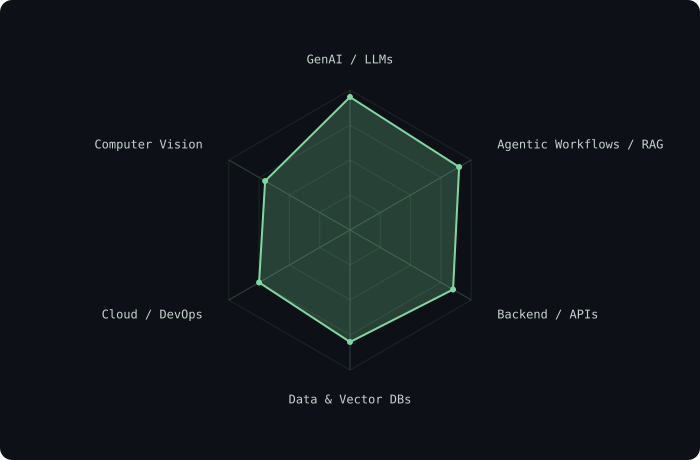
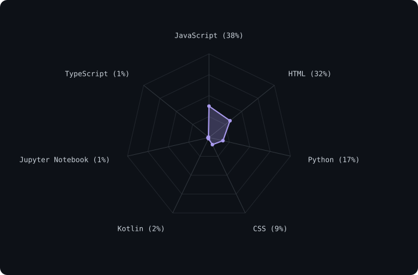
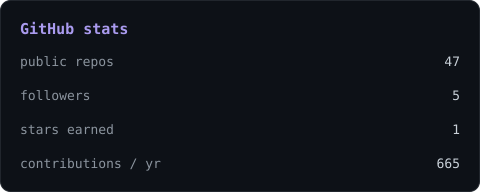
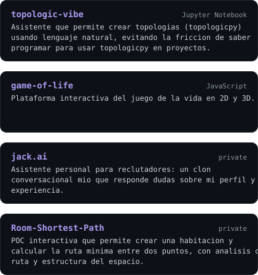

<!-- BANNER - terminal profile.sh --live. Generated by scripts/banner/generate.py. -->
<picture>
  <source media="(prefers-color-scheme: dark)"  srcset="assets/banner-dark.svg">
  <source media="(prefers-color-scheme: light)" srcset="assets/banner-light.svg">
  
</picture>

 

 

&nbsp;&nbsp;

 

---

## This is me :)

Software Engineer specializing in **Artificial Intelligence**, focused on building production-ready
Generative AI solutions. I architect agentic workflows, RAG systems, and scalable microservices that
solve real problems — from automating environmental impact assessments to linguistic research on
endangered languages.

- 🤖 **AI Engineer at NTT DATA Perú**: intelligent automation flows (`axet.flows`), Agent/Enabler nodes,
  Computer Vision + LLMs for corporate document interpretation.
- 🧩 **Software Developer at SimiAI**: AutoCAD add-ins (.NET/WPF) processing drone telemetry and point
  clouds for infrastructure routing.
- 🏗️ Previously at **Data Arch**: serverless AI assistant (LangChain + Gemini + Cloud Functions) that
  cut Life Cycle Analysis (carbon emission) evaluation time from weeks to minutes.
- 🌎 Researching a **Quechua Collao translation assistant** (GenAI + RAG + tool-calling) — accepted for
  presentation at SSILA 2026 (New Orleans) and the Glocal Conference at UPenn/IU.
- 💬 Ask me about **Agentic workflows, RAG, LangChain, MCP, FastAPI**.

 

## my perfect stack

---

## signals

<table>
<tr>
<td width="50%" align="center" valign="middle">

<!-- Self-rated radar - edit assets/skills.json, the workflow redraws it -->
<picture>
  <source media="(prefers-color-scheme: dark)"  srcset="assets/radar-dark.svg">
  <source media="(prefers-color-scheme: light)" srcset="assets/radar-light.svg">
  
</picture>

</td>
<td width="50%" align="center" valign="middle">

<!-- Language mix across active repos - edit assets/langmix.json -->
<picture>
  <source media="(prefers-color-scheme: dark)"  srcset="assets/radar-langs-dark.svg">
  <source media="(prefers-color-scheme: light)" srcset="assets/radar-langs-light.svg">
  
</picture>

</td>
</tr>
</table>

---

## Numbers matter? ohhh yes.

<!-- Generated by scripts/cards.py into this repo. Self-hosted instead of
     github-readme-stats / streak-stats: shared public instances go down. -->
<picture>
  <source media="(prefers-color-scheme: dark)"  srcset="assets/card-stats-dark.svg">
  <source media="(prefers-color-scheme: light)" srcset="assets/card-stats-light.svg">
  
</picture>

  

---

## featured projects

<!-- Generated by scripts/cards.py from assets/projects.json -->
<picture>
  <source media="(prefers-color-scheme: dark)"  srcset="assets/card-projects-dark.svg">
  <source media="(prefers-color-scheme: light)" srcset="assets/card-projects-light.svg">
  
</picture>

---

` Build with love · jinnbit@gmail.com `

